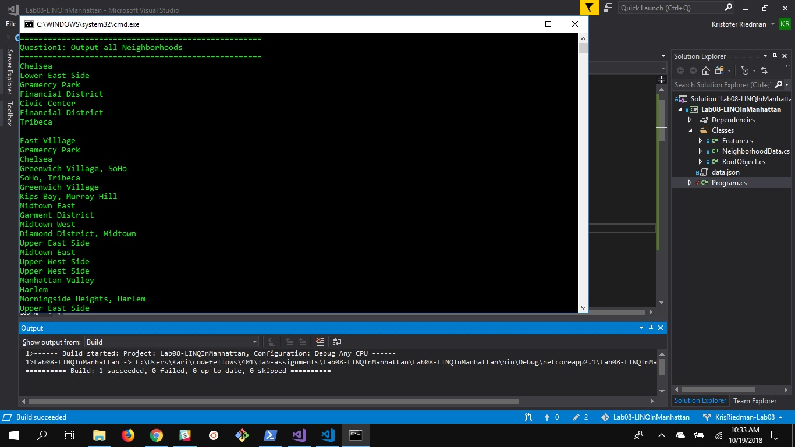
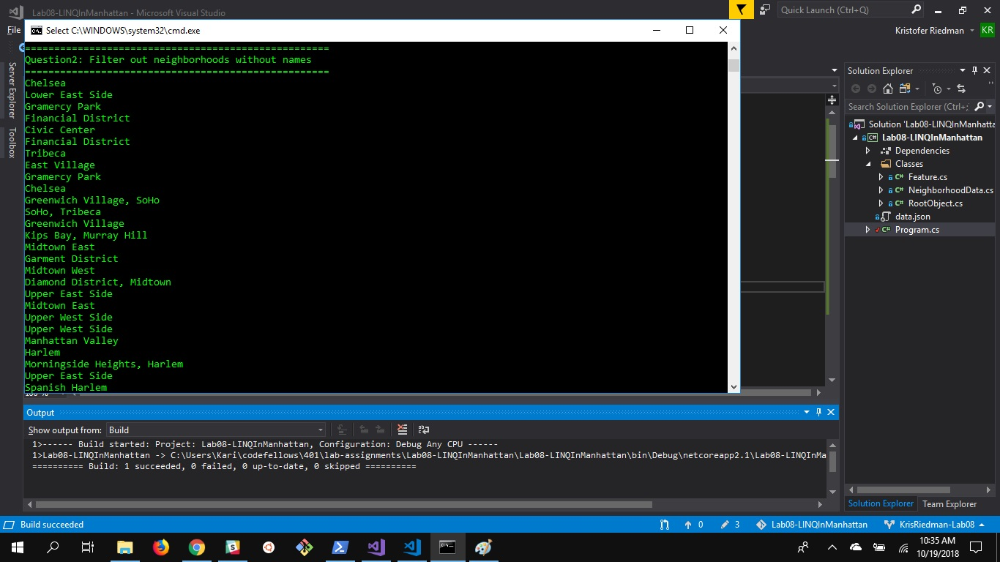
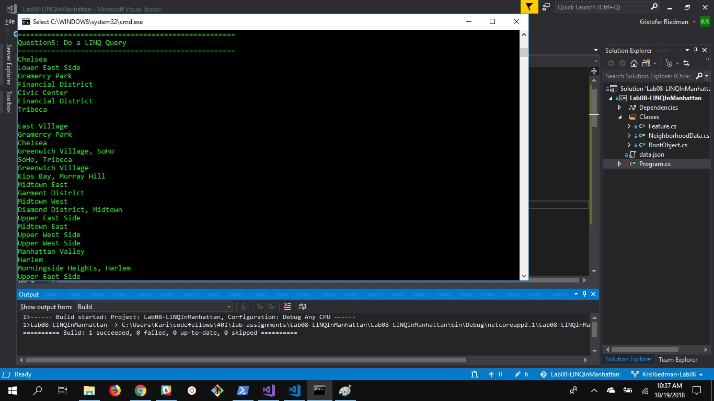

# Lab08-LINQInManhattan
## Description
This program reads a JSON file and deserializes it to C#.  The program then prints the results to the console.

## Instructions
1. Start Visual Studio
2. Open Solution File
3. Run without debugging
4. Review printed material

## Visuals

